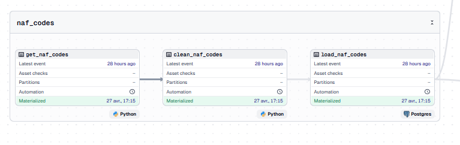
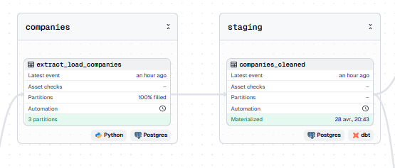
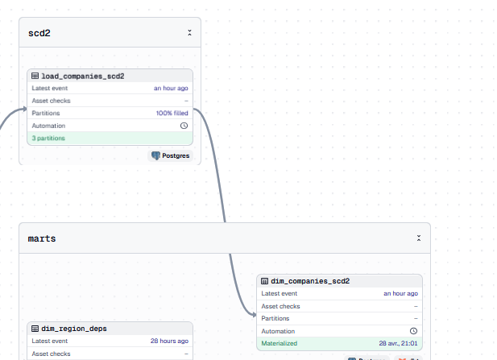
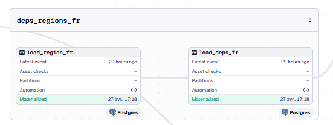
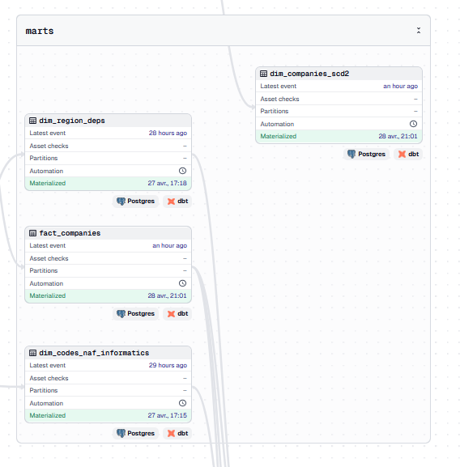
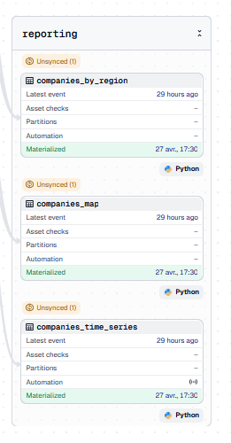

# 4DATA : création d'un flux de données pour les entreprises informatiques françaises 
## Auteur : Julien RENOULT - Tom JOUSSET - Béatrice BEAVOGUI
## Promo : SUPINFO Programme Grande École 4ème année
### Spécialité : Ingénierie Data
### Date : 10/04/2026 - 29/04/2026

# Introduction

Très souvent, savoir les entreprises informatiques relèvent d'une tâche complexe lorsqu'on mêne nos recherches et savoir les domaines qui dominent encore plus. L'annuaire du gouvernement nous permets de nous y aider dans sa recherche, tout de fois ne proposent pas de véritable analyse sur ces entreprises informatiques ni leurs changement au cours des de ces jours. C'est ce que nous allons répondre avec la mise en place d'un flux de données pour la recherche des entreprises informatiques françaises. 

# Pré-requis pour l'utilisation de la pipeline 

Pour pouvoir faire fonctionner cette pipeline et ces différents tests (pytest, uv), nous demandons que **Docker Desktop** ou équivalet soit installée et configurée avec ces configurations :
- autoriser au moins **4 CPU** à utiliser pour Docker afin que *Dagster* lance facilement ses jobs
- autoriser au moins **2 Go** de mémoire pour Docker afin que la mémoire ne soit pas dépassée

Si vous avez installé **Docker**, vous pouvez passer à la suite de cette documentation.

# Technologies utilisées (Installation/Déploiement)

Pour mener à  bien ce projet, plusieurs technologies ont dû être utilisées notamment :
- [**python**](https://www.python.org/) : langage de programmation
- [**dagster**](https://dagster.io/) : orchestrateur de nos pipelines
- [**dbt**](https://www.getdbt.com/) : outil ELT très utile pour le traitement de gros volumes de données
- [**PostgreSQL**](https://www.postgresql.org/) : base de données permettant l'insertion et le traitement de JSON très simplement pour un gros volume de données
- [**Power BI**](https://www.microsoft.com/fr-fr/power-platform/products/power-bi) : outil de datavisualisation

# Utilisation de la pipeline Dasgter

Comment lancer maintenant cette pipeline sous *Docker* ? Il existe trois façons de lancer cette pipeline.
La première, la plus simple si vous voulez tester seulement la version *dev* et non pas avoir le hot reload est de lancer le **docker-compose-dev-prod.yaml**. Pour ce faire, exécuter la commande ci-dessous.

```sh

docker compose -f docker-compose-dev-prod.yaml up --build

```

Dès que tous les conteneurs seront créées et les conteneurs lancées (vous devez voir apparaître cette ligne sur les logs de l'image *dagster*), vous pourrez accéder au pipeline via *http://localhost:3000/*.


Si vous voulez arrêter les conteneurs lancés, vous pouvez utiliser la commande ci-dessous :

```sh

docker compose -f docker-compose-dev-prod.yaml down

# Avec suppression des volumes
docker compose -f docker-compose-dev-prod.yaml down -v

# Relancer
docker compose -f docker-compose-dev-prod.yaml up

```

Si vous voulez le lancer en hot reload dev, vous devez utiliser le *docker-compose-dev.yaml* auquel il ne marchera que si le projet se trouve dans un système Linux (WSL, Ubuntu, etc) car le système de fichiers de *Windows*, *Mac* feraient buguer le lancement des conteneurs.

```sh

# Le lancer pour la première fois
docker compose -f docker-compose-dev.yaml up --build

# l'arrêter
docker compose -f docker-compose-dev.yaml down

# Avec suppression des volumes
docker compose -f docker-compose-dev.yaml down -v

# Relancer
docker compose -f docker-compose-dev.yaml up

```

**Attention, la partie prod ne marche pas, privilégier les autres au-dessus si vous voulez regarder les pipelines.**

Si vous voulez lancer en phase de prod, nous allons utiliser le dernier docker compose qui est **docker-compose-prod.yaml**.
Cela le lancera sans interface et sans les tests où vous pourrez le lancer seulement et ne pas interagir avec.

```sh

# Le lancer pour la première fois
docker compose -f docker-compose-prod.yaml up --build

# l'arrêter
docker compose -f docker-compose-prod.yaml down

# Avec suppression des volumes
docker compose -f docker-compose-prod.yaml down -v

# Relancer
docker compose -f docker-compose-prod.yaml up

```

Maintenant que vous avez lancé les conteneurs et attendu que *dagster* soit disponible, 
vous pouvez lancer les jobs (via l'onglet jobs) suivants et dans l'ordre indiqué :

- code_naf_job
- region_deps_job
- api_company_job
- clean_company_job
- scd2_company_job
- mart_company_job
- reporting_job

En allant sur chaque job, cliquer sur le bouton *Materialize all*, cela lancera tous les assets concernés par ce job.

Si vous voulez lancer les tests unitaires de **pytest**, il faudra vous connecter au terminal du conteneur *dagster* via la commande suivante :

```sh

docker exec -it dagster ../bin/sh

```

Veuillez exécuter les différents jobs indiqués avant afin de pouvoir faire tous les tests que ça soit unitaire ou intégration.
Après que vous serez connecté au conteneur dans le terminal, vous pouvez lancer les commandes ci-dessous :

```sh

# Conduire à l'emplacement des tests unitaires
cd /app/tests/

# Lancer les tests unitaires / intégrations
uv run pytest

```

Si vous voulez lancer les tests **dbt** pour les modèles, il faudra aussi être connecté au terminal du conteneur *dagster*
et lancer les commandes suivantes :

```sh

# Activer l'environnement virtuel pour lancer dbt
. /app/.venv/bin/activate

# Se diriger vers dbt
cd /dbt_informatics_companies/

# Lancer la commande test pour dbt
dbt test

```

Si vous obtenez un échec et que vous constater dans les logs qu'il y a cette information :

*\[DagsterApiServer\] Run execution process for ... was terminated by signal 7 (SIGBUS).*

Alors, c'est juste le Dagster qui s'est arrêté et faudra relancer le job concerné et le conteneur s'il s'est arrêté.

# Sources de données pour les pipelines

Pour nos différentes pipelines, nous utiliserons trois principales sources de données :

- API sur l'annuaire des entreprises françaises mise en place par le gouvernement français sur [**data.gouv.fr**](https://recherche-entreprises.api.gouv.fr/docs/)

- Un fichier Excel à disposition par l'[**INSEE**](https://www.insee.fr/fr/information/2120875) sur les intitulés des **codes NAF** (Nomenclature d'Activités Françaises) afin d'identifier les entreprises dans le domaine informatique

- Deux scripts SQL qui sont sur le site du gouvernement [**data.gouv.fr**](https://www.data.gouv.fr/datasets/regions-departements-villes-et-villages-de-france-et-doutre-mer) permettant la création des tables départements et régions

# Conception de l'orchestration

Maintenant que vous avez pu lancer et tester les pipelines par vous-même, il faut maintenant comprendre pourquoi cette structure.
Pour ce faire, on va vous le présenter en plusieurs parties avec une partie ETL pour les codes NAF, une partie ELT pour les entreprises informatiques, le chargement des régions et départements français, la création d'une table d'historisation de changement SCD2 et les tables analytiques. 

## ETL pour les codes NAF 

Pour ce qui est des codes NAF, il a été décidé pour simplifier le travail et avec l'exécution qu'une fois par an de ce processus de créer un ETL. Cette ETL permet d'aller chercher le contenu d'un fichier Excel pour capturer tous les intitulés des codes NAFs,  leurs intitulés, les intitulés des classes et des sections. Ca permettra notamment de se simplifier la tâche dans le filtrage des activités de type informatique.

Pour la mise en place sous Dagster, nous l'avons créé avec trois assets qui va exécuter chacune de ces étapes. 
La partie **Extract** va exécuter une requête HTTP permettant de télécharger le fichier Excel concerné et le conserver localement 
dans notre dépôt des données brutes. Ensuite, la partie **Transform** va nettoyer et formatter les données récupérées de sorte qu'on puisse avoir sur une même ligne le code d'activité principale, l'intitulé, le code de la classe parent, l'intitulé de celle-ci et le titre de la section. Pour terminer, la partie **Load** va quant à lui se charger de l'insertion des données dans la base de données **PostgreSQL**. 

La table créé dans PostgreSQL servira à deux buts. Premièrement, pour la **collecte des entreprises via l'API**, il est nécessaire que cette table soit créée avant que la collecte soit lancée. En effet, la collecte va aller chercher les différents codes NAF que nous aurons indiqué dans une requête SQL via les codes parents (ici, 62 et 63). Deuxièmement, **dbt** va s'en servir pour la création d'une table de dimension ne se concentrant sur les activités informatiques.



## ELT pour les entreprises

Après quelques discussions et remarques sur le comportement de l'API, il a été décidé de créer un ELT.
Pourquoi ? Car les transformations comme le JSON se font beaucoup plus simplement sous **PostgreSQL** et seront beaucoup plus rapides. De plus, c'est une exécution qui doit être journalière car des changements de données arrive assez souvent. 

Pour ce qui est de la création sous Dagster, deux assets ont été créés. Le premier asset va faire les étapes d'**Extract** et de **Load** en collectant les données *JSON* des différentes entreprises en partitionnant par taille (ETI, PME, GE). En effet, l'asset devient beaucoup plus efficace quand on sépare les entreprises selon la catégorie de taille associée. 

L'avantage avec cette API est que nous pouvons donner la liste directement des codes NAF à utiliser pour rechercher les entreprises informatiques. Cependant, il faut d'abord faire une étape de vérification des codes NAF récupérés afin de voir si elles sont dans les paramètres valides du filtrage de l'API. Cela provoquera une erreur si un de ces codes NAFs n'est pas dans les paramètres valides. 


Pour faciliter le suivi de l'exécution de notre extraction et chargement des données, nous avons mis en place de nombreux logs qui vont permettre de faire cela et indiquer le nombre de pages restantes à parcourir.

Après que la collecte soit terminée, ils seront chargées dans leurs forme *brute* avec les informations que nous voulons dans la table SQL *companies*.

Pour nettoyer les données, **dbt** va amplement nous aider par exemple, en extrayant les dernières informations fincancières, le formattage des dates, timestamps et l'ajout de la tranche d'effectif salarié. C'est là qu'on retrouvera notre deuxième asset exécutant un modèle dbt.



**Point important :** faites attention, l'API utilisée pour aller chercher les données n'est limitée qu'aux 10 000 plus grosses entreprises résultantes. Nous nous proposons donc de nous concentrer sur les 10 000 ou moins des plus grosses entreprises par catégorie de taille (ETI, PME, GE). Cela offre assez de données pour répondre à notre problématique.

## Table SD2C

Afin d'identifier les changements d'informations de nos entreprises, une table SD2C a été mise en place via un asset dagster. elle utilise directement la table des entreprises informatiques nettoyées pour indiquer s'il y a des changements. 

Le concept d'une table SD2C est d'ajouter de nouvelles lignes que quand c'est une entreprise nouvelle ou une entreprise déjà existante mais qui a ses informations mises à jours. Cela permettra de comparer avec les anciennes versions pour identifier des changements d'activités dans l'informatique, la non-existence maintenant de cette entreprise ou l'un de ces indicateurs qui ont changé. 

Nous ne prendrons pas en compte un seul attribut qui est la date de mise à jour. Cette information se mets à jour tous les jours et n'apporte donc aucune information concrète sur l'entreprise.

Pour terminer, après que la table de l'historique des changements ait été réalisée, **dbt** va s'en servir pour créer une table de dimension nommée **dim_companies_scd2** afin d'analyser ces changements au cours du temps via le rapport Power BI.



## Régions et départements

Pour l'insertion des départements et régions, deux assets ont été écrites afin de charger les noms et leurs codes de celles-ci.



## Tables de dimensions et de faits

Pour l'aspect analytique, plusieurs tables ont été créées notamment celles ci-dessous :

- **fact_companies** : table des faits contenant toutes les informations des entreprises

- **dim_companies_scd2** : table de dimension pour proposer une analyse des changements plus concrète

- **dim_region_depx** : table de dimension pour ajouter le nom de la région et du département via les codes

- **dim_codes_naf_informatics** : table de dimension pour ajouter les intitulés des activités principales et des parents

Ces tables analytiques nous permettent de proposer plusieurs axes d'analyses qu'on peut observer sur le rapport Power BI *suivie_entreprise_informatique_française.pbix* dans le dossier dashboard.



## Reporting automatisé

En plus du rapport Power BI, on a créé via un *Sensor* la création d'une carte intéractive HTML et de deux graphiques. 
Leurs objectifs est d'offrir une visualisation globale des entreprises sans passer par le Power BI où lui va apporter des filtrages 
afin d'offrir beaucoup plus d'axes d'analyses.

